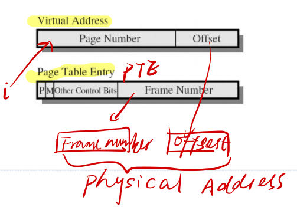
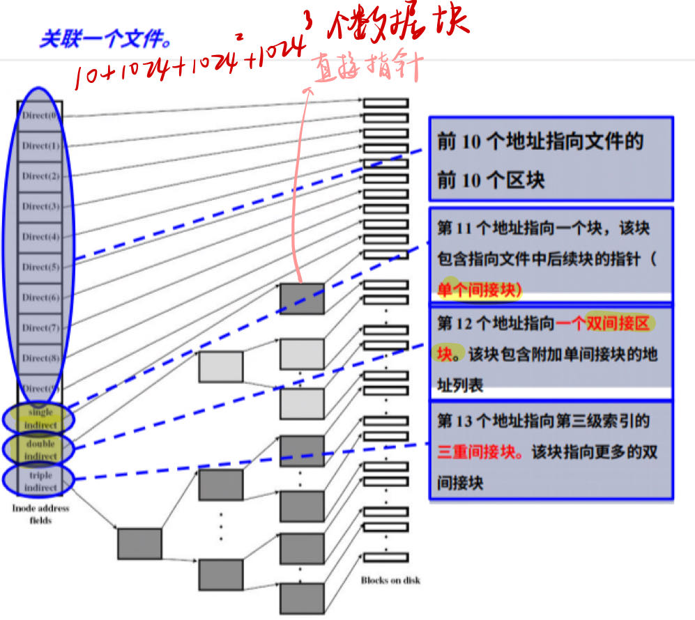
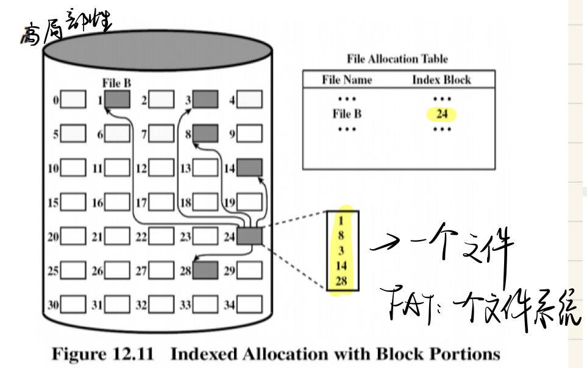

# 操作系统概述
## 一.什么是操作系统
- 操作系统是一种程序
    - 管理计算机硬件
    - 控制应用程序的执行
    - 充当应用程序和硬件之间的接口
## 两个基本功能：
- 自上而下（上看下）的一种拓展机器，进行资源抽象，强调用户方便
- 自下而上（下看上）是一种资源管理器，进行资源共享，强调资源的有效利用，使得硬件能在多个用户之间有序、有节制共享
    - 空间多路复用：资源被分为多个单元
    - 时间多路复用：一个进程使用某个资源一段时间，另一段时间给另一个进程使用

## 二.操作系统的演化
### 1.串行处理
- 程序员直接与硬件交互，没有OS
- 一次只执行一个程序
- 无需资源共享，一次一个用户
- 预约和设置时间
### 2.简单批处理
- 晶体管
- 用户列出清单交给monitor，不直接接触机器
- 操作员(operator)将工作序列化聚集，并放在输入设备给monitor
- JCL作业控制语言
### 3.多道批处理系统
- uniprogramming：cpu与IO速度不匹配，处理器经常是idle(空闲的)
- multiprogramming：一个进程需要等待IO请求，进程进入block状态，cpu调度别的进程，直到IO准备好，原本被中断的进程block->ready
### 4.委托机（spooling）
- 用一个程序，代替操作员进行脱机操作，从磁带读数据到磁盘。
### 5.分时系统time sharing system
- 将处理器的时间划分给多个用户进行交互
- 最小化响应时间，multiprogramming是maximize processor use
- 输入的是终端的命令，multi是JCL
## 三.重要概念
### 1.进程
#### 概念：
- 执行的程序
- 电脑上正在运行的程序的实例
- 处理器上可以被分配和执行的实体
- 一个活动单元，特征是一个连续的执行线程、一个当前状态和一组资源
## 四.系统调用
### 概念
- 一组系统调用时操作系统和用户程序之间的接口，不同操作系统的系统调用各不相同。

# 进程
## 一.概念
- 执行中的程序
- 计算机上运行的程序实体
### 抽象机器包括：
- 操作系统系统调用
- 用户模式指令（包括trap指令）
## 二.进程转换 （重点）
- running-Ready
    - 运行进程已达到最大允许时间
    - 一个正在运行的进程被另一个优先级更高的进程抢占，比如之前发出IO请求的进程要重新运行，就会直接顶掉
    - 进程可自愿解除对处理器的控制
-  Running-Blocked
    - 一个正在运行的进程需要IO的工作，要发请求给IO，它就会进入阻塞状态。（等待IO操作完成或来自其他进程的消息）
- BLOCK-Ready
    - 当处于"Block"状态的进程正在等待的事件（如IO）<strong>完成</strong>时，该进程就会转入"就绪"状态。
### 交换(Swapping)
- Suspended Process（挂起进程）
对于一个没有使用虚拟内存的系统，要求所有运行的进程对应的代码数据都在主存，当主存满了，就要把主存中的部分闲置进程移出主存到磁盘
- 一个suspend
    - 所有suspend的进程都处于block，如果等待的event完成，就不会block
- 两个suspend（之间转换条件是事件完成）
    - block/suspend
    - ready/suspend

### 重要的转换
- block->block/suspend:当前没有ready的进程以及主存没有空间
- block/suspend->ready/suspend:event完成
- ready/suspend->read:主存中没有准备就绪的进程或者主存中就绪的进程优先级不如ready/suspend的优先级
## 三.进程描述
### 1.进程表与进程控制块（略可能 看看题目多不多）
- 进程表是OS维护的一个表
- 进程控制块是进程表的条目
    - 进程位置
    - 进程属性，如ID和状态
#### 进程控制块的组织
- 链接
- 索引

### 2.进程映像（Image）

- 进程映像：下面这些的集合
    - 进程包含一组要被执行的程序
        - 局部和全局变量的数据位置
        - 常数
        - 堆
        - 栈
    - 进程控制块
## 四.进程控制
- 用户态
- 内核态（除了user mode都是内核态）more privileged mode
- 区别：
    - 一些指令只能在内核态执行
        - 读取或改变控制寄存器，如程序状态字
        - IO指令
        - 与内存管理有关的指令
    - 某些内存区域只能在内核态访问
- 分成两个模式的原因：
    - 保护操作系统和关键操作系统表不受用户程序干扰
    - 防止用户程序访问资源

- 监控模式执行操作系统代码，当用户模式调用操作系统时处理器会切换到内核态
- 计算机启动
    - 内核态启动，用于引导和操作系统初始化系统
    - 应用程序以用户模式运行
        - 不能轻易进入内核模式，更改<strong>处理器状态</strong>指令是特权指令
    - <strong>只在响应trap和interrupt才会发生</strong>
## 五.进程创建
### 创建步骤
- 分配独一无二进程识别号
- 分配空间
- 初始化进程控制块
- 建立适当的连接，如：在调度队列的链接列表增加新的进程
- 创建拓展其他数据结构
### 从程序到进程
- 将代码和静态数据从程序加载到process，program是磁盘上的可执行格式
- 给栈和堆分配空间
- IO相关初始化任务
- 在入口处启动
### 为什么要把fork()exec()分开
这样可以让shell在调用了fork()之后，调用exec()之前完成一些工作，如输出重定向时需要知道重定向的目的文件，管道机制也要知道目的文件
## 六.进程中止（略）
## 七.进程切换（重要）
<strong>定义：</strong>运行中的进程被中断，OS将另一个进程分配到Running状态，并将控制权交给那个进程

### 1.什么事件会触发process switch？<strong>
- 两种系统中断：
    - 中断：外部事件，与当前进程无关（如原本block的进程变为ready了要切换回来）如：时钟中断，IO中断（IO完成了要切换为原来的进程）running->ready
    - trap：当前运行的进程中出现错误和异常情况，如：缺页故障running->block，整除错误running->block/exit
- 系统调用（system call /supervisor call）：在运行的程序中显性调用系统效用请求系统功能</strong>
如果trap是致命的会直接exit
### 2.process switching和mode switching有什么区别？
- mode switching：发生进程切换一定有模式切换，反之不一定。需要硬件
    - 保存上下文（操作系统保存寄存器的内容）
    - PC设置为中断处理程序起始地址（中断处理程序保存PC值、程序状态字寄存器）
    - 切换内核态，处理代码可以包含特权指令

发生进程切换一定发生了中断，但发生中断不一定发生了进程切换。也可以停着等待
- 进程切换：
    - 保存上下文，中断处理程序保存PC和程序状态字寄存器，操作系统保存通用寄存器
    - 更新当前运行进程的进程控制块
    - 将进程控制块移动到适当队列
    - 选择另一个ready进程执行
    - 更新所选进程的PCB
    - 更新内存管理数据结构（地址转换管理）
    - 恢复所选上下文
### 3.操作系统要做什么（参考上面）
## 八.进程通信（IPC）
### 1.共享存储（shared memory）
通信进程间有一块可以直接访问的共享空间，通过对共享空间的读写进行信息交换，读写必须互斥
### 2.消息传递（message passing）
通过send（），recv（）的消息传递进行进程间的通信，可能出现死锁（互相等对方的消息）和饿死（一直等不到消息）

# 线程
## 一.概念
### 1.进程与线程
- 进程：资源所有权、调度/执行
- 线程：调度的最小单元

<strong>定义</strong>：是CPU利用率的基本单元，包括：线程ID、PC、寄存器组、栈
- 与其他在同一进程共享：代码段，数据段，OS资源，如：打开的文件和信号
- 好处（相比进程）：
    - 创建终结切换时间更少
    - 不需要切换内核态就可以交流切换
    - 加速应用

### 2.多线程
#### 定义
单个进程中支持多线程执行的能力，进程被定义为资源分配和保护单位


    - 代码段（Code Segment）：所有线程执行相同的程序代码。
    - 数据段（Data Segment）：全局变量和静态变量是在所有线程之间共享的。
    - 堆（Heap）：动态分配的内存（如通过 malloc() 或 new 分配的内存）也是共享的。
    - 文件描述符、套接字和端口：打开的文件、网络连接等也是可以被所有线程访问的。
    - 进程标识信息：如进程ID和父进程ID。
    - 信号处理器（Signal Handlers）：对于Unix-like操作系统，信号处理是在- 进程范围内设置的，因此所有线程都会共享同样的信号处理行为。
    - 环境变量：环境变量是所有线程共享的。
    - 程序计数器（Program Counter）：虽然每个线程都有自己的程序计数器，但所有线程的程序计数器都是基于同一代码段。
    - 用户ID和组ID：这些也是在进程级别设置的，因此所有线程都会共享它们。

线程具有一些独立的属性，比如：

    栈（Stack）：每个线程都有自己的栈，用于存储局部变量和执行函数调用。
    寄存器状态（Register States）：每个线程都有自己的寄存器内容。
    线程优先级和调度：操作系统通常允许单独为每个线程设置优先级和调度策略。
    线程局部存储（Thread-Local Storage）：这是每个线程特有的数据存储区域。
    线程ID：每个线程都有一个唯一的线程ID。


#### 每个线程有自己的栈
- 每个存储过程被调用但是没返回
- frame包括过程的本地变量和过程调用完成的返回地址
- 每个线程会调用不同程序，因此有不同的执行历史
#### 状态
- 派生spawn：产生另一个线程
- 阻塞block：等待事件发生
- 接触阻塞unblock：被阻塞的事件发生了，线程被移动到就绪队列
- 结束：清空寄存器上下文和堆栈

### 3.多线程模型
#### 线程实施分为两大类：
- user-level thread（ULT）

    - 线程管理由用户程序完成，内核不知道线程存在
    - 线程库进行管理
    - 每个进程有私有线程表用于跟踪进程中的线程
    - <strong>进程block/ready，线程可能running，一个进程只能有一个线程running</strong>
    - 3种情况：
        - 线程发出阻塞调用：进程也被阻塞
        - 进程时间片用完：进程running->ready
        - 线程2要等待线程1做事：2block，1running
    - 优势：
        - 线程切换不用切换到内核模式
    - 缺点：
        - ULT执行系统调用并被阻塞，所有线程都被阻塞
        - 多线程应用无法利用，一个进程一次只执行一个线程
- kernel-level thread（KLT）

    - 线程管理工作由内核完成
    - 线程表在内核
    - 优势：
        - 多个处理器上可以同时调度同一进程的多个线程
        - 一个线程阻塞，内核可以调度统一进程的另一个线程
    - 缺点：
        - 所有线程切换都要进行模式切换
        - 阻塞线程的调用要作为系统调用
#### 多对一、一对一、多对多

## 4.线程库
## 5.线程事务
### 线程池
- 进程启动时创建若干进程，放进线程池
- 服务器收到请求，从线程池唤醒一个进程
### 调度程序激活：轻量级进程LightWeight Process（LWP）
- 实现多对多模型，在用户和内核线程之间增加的数据结构
- 对于用户线程库，LWP是一个虚拟处理器，线程可以在LWP上运行
- 每个LWP连接一个内核线程，一个系统调用用一个LWP
- upcall（回调）：
    - 线程要被阻塞时，触发回调
    - 内核发出upcall，通知并标识阻塞线程
    - 内核分配新的LWP给用户程序，用于运行回调处理程序。保存阻塞线程状态释放阻塞线程原来的LWP（原来的LWP没了）
    - 回调处理程序调度另一个程序在新的LWP运行
    - 事件发生（完成）后，触发另一个回调
    - 抢占别的LWP或者新建一个LWP运行回调程序，重新运行原来的线程

# 同步与互斥
## 一.抽象的锁互斥机制
- 进程数
- main函数
- 进入临界区
- 出临界区
## 二.实现互斥的关键：忙则等待、空闲让进、有限等待、让权等待
## 三.软件方法互斥
序列化串行化
### 1.Dekker算法

### 2.Peterson算法

## 四.硬件方法互斥
### 1.开关中断
只用于单处理器，不使用多处理器
### 2.Test and Set（TSL）
```
bool TestandSet(int i){
    if(i==0)    {
        i=1;
        return 1;    }
    else{
        return false;    }}
int i=0;
P(){
    while(1)    {
        while(!TestansSet(i)){
            wait();        }
        /*critical*/
        i=0;    }}
main(){parbegin()}
```
## 五.semaphores（重点）
会写代码
### wait()/signal()
- wait():cnt--; if(cnt<0){放入队列，阻塞进程}
- signal():cnt++;if(cnt<=0){移除队列的一个进程并放到ready list}这里就是多了一个可以用的资源，不管cnt是否是负数还是0
- <strong>cnt就是可以用的资源数</strong>
### 读者写者问题
分类问题，谁有优先级就给另一个多上一道锁

过桥没有优先级，所以不用wsem和rsem区别，只要一个bridge
### 生产者消费者问题 

## 六.通信
### 1.直接寻址
- 对称：都要写来源和去处，连成一对
- 不对称：发要写进程p，接收可以从任何接收，只要写发送者id，如打印机
### 2.间接寻址 mailbox
### 3.同步
- 阻塞发送，阻塞接收
- 费阻塞发送，阻塞接收
- 无阻塞发送接受
### 4.消息缓冲（buffer）
一个用于消息交换的队列，保存已发送但是尚未接受的邮件
# 死锁
## 一.死锁原理
### 1.两类资源
#### 可再生资源
同一时间被一个进程使用，使用结束不会被销毁
- 例子：处理器、IO、主存和辅存、设备、数据结构
- 可以通过semaphore实现request(),release()
#### 可消耗资源
可创造和销毁的资源
- 例子：中断、信号、信息、IO缓冲的信息
发送接收交叉会死锁
### 2.四个必要条件（重要）
- 资源互斥
- 资源非抢占
- 占有且请求
- 循环等待
#### 资源分配图

## 二.死锁预防prevention
从四个必要条件出发
- 互斥不能违反
- 资源非抢占：抢占那些正在等待别的资源的进程所占有的资源。在请求别的资源时其他资源可能被抢占
    - 只适用于状态可以轻松保存并稍后恢复的资源，如：CPU寄存器和内存
- 占有且等待
    - 一次性占有
    - 不占有资源时才允许请求
    - 可能会饿死
- 循环等待
    - 给资源标上优先级，只能申请比占有的资源优先级更高的资源

## 三.死锁避免avoidance
- 进程启动拒绝：不启动可能会死锁的进程
- 资源分配拒绝：如果要分配的资源会导致死锁就不分配
- 安全状态：
存在一个安全序列，就是安全状态
- 不安全状态：
没有一个安全序列，一定会导致死锁
- 死锁状态：
当前死锁了
- $Resource=(R_1,R_2,...,R_m) $->资源总数 
- $Available=(V_1,V_2,...,V_m) $->当前可用的资源
- $$Claim=\begin{pmatrix}
C_{11}&C_{12}&...&C_{1m}\\
C_{21}&C_{22}&...&C_{2m}\\
...&...&...&...\\
C_{n1}&C_{n2}&...&C_{nm}\\
\end{pmatrix}$$  每个进程对各种资源的需求，总的
- $$Allocation=\begin{pmatrix}
A_{11}&A_{12}&...&A_{1m}\\
A_{21}&A_{22}&...&A_{2m}\\
...&...&...&...\\
A_{n1}&A_{n2}&...&A_{nm}\\
\end{pmatrix}$$   当前各个进程已经被分配的
### 1.进程启动拒绝
假设所有程序同时提出最大要求，很难达到最佳效果

### 2.资源分配拒绝（银行家算法）（重要）
#### 算法方法
- 先计算出need矩阵，算出各个进程对于每个资源的需求
- 只有当当前可用的所有资源被分配给请求进程后仍旧出于安全状态才会分配，否则不会分配
- 分配后进程归还资源，进程一个一个执行
- 找出一个安全序列，能分配不死锁
## 四.死锁检测和恢复detection and recovery
### 1.确定是否会死锁的算法（不需要claim）
- 标记分配矩阵中全为0的每个进程
- 看每个进程请求的资源，是否每个都小于可用的资源，如果是就回收已分配的资源，并标记0
- 看是不是所有进程都被标记
### 2.从死锁中恢复的算法
- 进程中止，结束循环等待
- 资源抢占，从陷入死锁的进程中抢占一些资源
- 终止所有进程
- 被分到某个检查点（checkpoint）rollback并restart
## 五.死锁解决哲学家问题
最多只让4个人上桌

# 调度
## 一.3个调度
- 长程调度：进程创建New->ready,new->ready/suspend
- 中程调度：ready->ready/suspend,block->block/suspend
- 短程调度：ready->running
### 长程调度
- 受处理器限制进程 processor-bounded process：主要执行计算工作，偶尔使用IO
- 受IO限制的进程 IO-bounded process：花更多的时间使用IO设备
- 分时的交互式程序要提高响应速度，是IO-bounded process

### 短程调度
- 进程由IO等待和CPU执行周期组成，在这两种状态（CPU burst，IO burst）交替，CPU burst作为终止
#### 抢占调度
- nonpreemptive：running->block:IO请求，或者wait()
- preemptive：running->ready:另一个进程的IO请求完成，或出现外部中断（如时钟）
- preemptive：block->ready:IO完成
- nonpreemptive：进程中止
##### 抢占式比非抢占式开销更大
<strong>周转时间turnaround time（TAT）等待时间+服务时间</strong>
<strong>归一化周转时间Normalized Turnaround Time：周转时间/服务时间</strong>

#### FIFO
- 先来先服务
- 优先长进程，偏爱CPU-bounded进程
#### RR
- 轮转时间，在有进程在等时，进程执行了一段轮转时间就切换队列中的第一个进程
- time quantum
    - 过长：短进程被处理更慢，但是可以减少进程切换开销
    - 过短：短进程更快被处理，但切换进程的开销大
- 一个时刻同时有新进程和被切换的进程进入队列时，<strong>被切换的在后面</strong>
- IO绑定进程性能不佳，因为如果时间片太短会只执行一下就被切换
#### VRR
- 引入FIFO辅助队列，当进程从IO块释放后，就会被移动到该队列
#### STN
- 最短下次优先，非抢占，运行完调入队列中最短的
- 最长等待时间可能会很长，长进程不利可能饥饿，非抢占式最优
#### SRT（Shortest Remaining Time）
- 抢占式，考虑当前进程剩余的时间和新来的进程哪个更短
#### 优先级调度
- 可以静态或动态为进程分配优先级
- 可以抢占也可非抢占
#### HRRN（Highest Response Ratio Next）
- 尽量缩短每一个进程的归一化周转时间（周转时间/服务时间）
- 非抢占，把最大的调来执行
#### Multilevel Queue Scheduling
- 反馈机制，惩罚运行时间较长的队列，每次被切换都被下移，优先级最低的队列RR，其余使用FIFO
- 优先级高的队列依次执行
- 更新更短的比更老更长的进程更受青睐
...
# 内存管理（简单内存管理）
- 地址空间：独立和保护
- 内存分配：高效利用
- 如果没有内存抽象，程序使用实际物理空间，多个程序会让内存空间的数据乱写乱读
## 一.地址空间（address space）
- 用于address内存
- 每个进程有独立的address space
## 二.背景
### 1.用户程序的多步处理
- 地址在不同步骤的表现形式：
    - source program:symbolic
    - compiler:bind symbolic to relocatable address
    - linkage editor or loader: bind relocatable address to absolute address
- 不同时间绑定：
    - 编译时；事先知道进程在内存的驻留位置，生成的绝对代码直接从该位置向后延伸，地质变化要重新编译
    - load time：编译时不知道进程在内存的位置，compiler生成relocatable code，有relocatable address，在load时bind，地址更改重新加在
    - runtime：执行时可以从一个内存段移到另一个内存段，延迟到runtime，大多是计算机使用
### 2.logical address vs physical address
- 逻辑地址：CPU生成的地址（virtual address）
- 物理地址：内存单元看到的
- 编译和加载时进行地址绑定：逻辑物理相同
- runtime时进行地址绑定：逻辑物理不同
### 3.MMU（Memory-Management Unit）内存管理单元
- 将虚拟地址映射到物理地址
- 逻辑地址+重定位寄存器（relocation register）=物理内存
### 4.链接linking
- 将引用的模块从符号地址改为模块在内存中的开始位置
- 编译（静态），load，running（动态）
### 5.交换swapping
### 6.覆盖Overlap
- 是进程的容量能够大于内存的容量，只保留在任何时候都需要的指令和数据，不需要操作系统支持
## 二.连续内存分配
### 1.固定分区
- 一个分区一个进程，有内部碎片
- 分区大小可以相等也可以不相等
- 程序太大无法装入分区，要是用overlap设计
- 利用率极低
- 大小不相等放置原则：能容纳的最小分区
- 优点：简单，最少操作系统软件和处理开销
- 缺点：限制活动进程数量，如果大小不匹配会降低内存空间使用效率
### 2.动态分区
- 分区的大小与进程大小相等
- 会有外部碎片，Compaction压实
- 可以使用链表进行内存管理 P start length->H start length
- 分配算法：
    - Best-fit：最小空洞，最差
    - First fit：从头开始扫描，第一个能放的空洞，最简单最好
    - Next fit：最后一次放置位置开始的下一个，更频繁在末端分配内存块，往往有最大内存块，大内存块容易很快被分成小内存块
- 内存回收
### 3.伙伴系统（Buddy System）
- 单个可用空间都是$2^k$大小，找最小的放
- 如果进程结束空间释放，跟前面的能合并成$2^k$就合并，内部碎片小于50%
### 4.重定位Relocation
- 重定位基址寄存器：物理
- 限值寄存器：虚拟，加之前先比较

## 三.分页
### 1.概念
- 进程被分成一块一块，逻辑->page，物理内存->frame
- 进程最后一页会有内部碎片
### 2.页表page table和逻辑地址
- 操作系统为每个进程维护一个页表，一个进程->一个页表
- 一个页表entry对应一个页。有多少个页就有多少个页表条目

### 3.页大小page size
- 通常是$2^k$,k就是offset位数，一个frame的地址数量也是$2^k$
- 逻辑地址与物理地址位数不一定一样，但是offset一样
- 页表是个类似数组的东西，里面数据的位数就是物理地址的frame数的$log_2$

### 4.保护
- 每个<strong>frame</strong>都有保护位,告知进程能否访问，如果引用无效页面会trap
### 5.共享页面
- 不同进程的相同部分可以映射到相同的物理空间
## 四.分段segmentation
### 1.概念
- 用户进行分段，将内存看成大小可变的段的集合
- 程序包括：主程序和一组子程序，解析数，符号表，栈，每个不同的部分分成不同的大小可变的段
- 支持用户对于内存的视角
- 逻辑地址：段号+段内偏移--segment id+offset
- 有外部碎片
### 2.分段表条目STE（Segment Table Entry）
- 将二维逻辑地址映射成一维物理地址
- 包括index：length+base，起点和长度，起点就是物理内存

- 先算segment id+base register=index，查找段表第index个的length和base，比较offset和length看有没有超出范围，物理地址就是<strong>base+offset</strong>

### 3.段共享和保护
- 段共享是信息的逻辑单元，共享应该以信息的逻辑单元为基础，为用户共享提供方便
- 不同分段有不同的保护措施，同一分段所有信息通常以同一方式使用，区分程序和数据并加以保护
## 五.段页式管理
- 用户的地址空间被分为好几段，每个段又由页组成
- 逻辑地址=分段编号+段偏移+页内偏移
### 1.段表和页表
- 段表映射的是页表的索引基址
- 页表查询实际的frame号
- frame号加offset得到物理地址

## 总结
页表是offset直接拼到后面
段表是base加offset，好像是差不多的


# 内存管理（虚拟内存）
## 一.虚拟内存
### 1.缺页故障
进程要访问的页不在主存中，在辅存中，会导致trap
- 从running->block,并发出磁盘IO读取的请求，IO启动
- 调度另一个进程执行
- IO完成后发出中断，导致缺页故障的进程从block->ready，并根据优先级考虑要不要抢占
### 2.概念
- 允许不完全位于主存中进程执行
- 将主存抽象为一个超大同意的存储阵列
- 允许共享内存
- 高效进程创建
### 3.执行
- OS将程序片从辅存移到主存，被移到主存的程序片部分称为驻留集（进程在主存中的部分）
- 详情见缺页故障
### 4.优点
- 主存中可以保存更多进程
- 用于swap的IO开销变小，因为主存中的不同进程多了，swap是进程级的
- 进程可以大于主存，程序员感知到更大的内存，实则是分配在磁盘上
### 5.抖动Thrashing
- 处理器花费大量时间swap片段而不是执行指令，某个进程片段在刚换出主存后又要使用，因此要找出之后最不可能被使用的程序片换出主存
- 虚拟内存满足局部性
## 二.硬件支持（分页、分段、段页式）
### 1.分页
#### 控制位
- present：主存中是否存在
- modified：页面自从上次被载入主存后是否被修改 
- referenced：页面是否被引用
#### PTE（page table entry）（重点！！！！）
- index：控制位|frame number
- 虚拟内存有多少个页就有多少个PTE
- <strong>物理内存地址数=$2^{offset+frame number}$</strong>

- 页表中找到第page个entry，entry中的frame对应PA中的Frame号，offset是页内偏移

- 问题：页表结构可能很大，虚拟地址32位（4bytes），如果page size 4KB（$2^{12}bits$）12位offset，20位page num，有$2^{20}$个PTE，如果一个PTE$4bytes$,就要4MB
    - 所以设计出多级页表、反转页表、Translation lookaside buffer快表（TLB）
### 2.两级（多级）页表
- 部分页表可能在辅存，相当于是把一个页表拆成很多个，分开存，一个页表存在一页中
-

    例题：
    某计算机有64位虚地址空间，页大小是2048B.每个页表项长为4B。因为所有页表都必须包含在一页中，故使用多级页表，问一共需要多少级？ 

    最佳答案
    2048B=2^11  
    64-11=53（地址中扣除页内地址位数） 共有2^53页
    一页中可以装2048/4=2^9个页表项
    9*6>53  至少需要6级页表 

### 3.反向页表
- 页表：index（frame）：page
- 在页表中找到内容相同的page号，没有说明缺页
- 有多少个frame就有多少个IPT
- 可以用哈希表加快搜索速度，要读取至少两次内存，一次哈希一次反转页表
### 4.Translation lookaside buffer快表（TLB）（重要！）
- 高速缓存，是MMU的一部分，将虚拟地址映射到物理地址，如果hit就不用通过页表
- 包含了最近使用过的页表条目（局部性）
- 并行找TLB，找到直接映射，没找到去内存找页表，有就映射，没有就缺页

- TLB和PTE结构不一样，TLB：page（VPN）|frame（PFN）|其他位，要找到对应page号

- 不同进程的TLB不同，有不同的地址空间标识符（ASID），切换进程时要刷新，（这部分在P351），操作系统在上下文切换将特权寄存器设置为当前进程的ASID，硬件要知道当前运行是哪个进程
### 4.页面大小 page size
- 大好：
    - 页表大小，pagesize越大，pagetable size越小，因为页面数少
    - 有利于辅存传输大数据块，IO不用频繁加载。如：加载64个512字节页面需要64* 10ms，但是加载4个8K字节页面只需要4*12ms
    - 缺页故障数减少，如果页面大小为1kb，一个200kb的进程有100kb在主存中，就会有100次page fault，但是如果页面大小为100kb就只有1次
    - TLB hit，页面越大，TLB越容易hit，因为存在TLB一个条目的地址数变多了，命中可能性变大
- 小好：
    - 内部碎片
    - 定位性（Locality），offset变小更容易定位
### 5.分段和段页式
- 段表结构：控制位|长度|段表起始位置
- 段页式：一个进程--一个段表，多个页表，段表查到的位置对应第i个页表，

## 三.软件支持（一些将辅存的进程块放到主存的策略）
### 1.读取策略：请求式还是预处理
- 请求：要的时候带入
- 预处理：把相邻的读进主存，但是如果用不到可能会浪费。辅存时间：seek time+ rotational latency
### 2.安置策略：放在哪里
### 3.替换策略：换哪个（重要）
进程的分块置换算法（前面的是整个进程的调度）
- page fault rate：主存中没有的都会fault，包括第一次进来的
#### OPT（optimal）最佳
知道未来要使用的信息，把未来<strong>最迟</strong>要用的替换出去
- 最好但是不可能实现
#### 最久未被使用 (LRU)
- 距离上一次使用最久的页面被替换出去
#### FIFO
一个进程集有个指针，轮着走，不管有没有被用，指的地方被换掉
- Belady：FIFO（先进先出）算法时，如果对一个进程未分配它所要求的全部页面，当主存分配给进程的帧数增加（帧数小于进程块数），page fault反而增加
    - 堆栈算法解决belady：如在LRU算法中，分配n个帧是分配n+1个帧的子集，也就是说分配n个帧不会缺页时，分配n+1个帧就一定不会缺页，从空 cache 开始，直到 LRU(n) 第一次出现缺页，此时 LRU(n+1) 一定不缺页

#### 二次机会（Second Chance Algorithm）
对FIFO的改进，添加引用位，如果引用位为1，就改为0，指针向下找，如果被使用就把引用位设置1指针不动，被替换掉指针往下

#### 加强时钟策略--脏页面
- 没使用没修改
- 没使用但修改
- 使用了没修改
- 使用了修改了
- 算法：
    - 找u=0,m=0
    - 找u=0,m=1,每个u置零
    - 找u=0
### 没有最好的策略，在每一种情况都有某一个算法在一些方面最优
#### 页面缓冲（page buffering）
提前读滞后写
- 保留空闲帧池，发生页面故障时，先读出辅存的页，放在空闲帧池，直接启动，无需等待被替换出的页面被写出 
### 4.驻留集管理策略（重要）
确定引入进程放在内存的页面数
- 单个进程引入页面数越少，页面故障率会高
- 引入页面数超过一定数量，缺页率不会有太大差异
- 要找最小的最大值
#### 固定分配
本地替换，替换同一进程的页
#### 可变分配
本地或者全局都可以
- 本地：
    - 缺页率高时，增大进程的驻留集页面数
    #### 工作集（重要）
    - 工作集窗口大小window size $△$：最近使用的$△$个页面，去重版，不是工作集页面数量,工作集大小可以随时间变化
        
    - 只有当进程的驻留集包含了工作集，工作集都在主存中时，进程才能运行
        
    #### PFF 缺页故障频率
    - 故障率越高，增大驻留集
    - 故障率降低，释放驻留集的帧
    - 算法：
        - 当缺页发生时，记录上次缺页的时间间隔，如果小于threshold F就在驻留集增添一个页面
        - 如果大于F，就丢弃所有使用位为0的页面，缩小驻留集，并把剩余的页面使用位设置成0
    #### 采样时间可变的工作集（VSWS）
    
        
- 全局：
    - 最简单，许多操作系统采用
    - OS保存空闲frame的列表
### 5.清除策略
### 6.负载控制：确定在主存中的进程数量
确定驻留集的进程数量--一个进程的页数
- 进程多：缺页，thrashing
- 进程少：整个进程阻塞，要swap
- 驻留集足够大的进程才允许执行

# 文件系统
## 一.概念
- 操作系统的抽象：
    - 磁盘空间（辅存）--文件和目录
    - CPU--进程
    - 主存--地址空间
- 包括两部分：
    - 文件集合
    - 目录结构
## 二.文件
记录在辅存的相关信息的命名集合，数据要被写入辅存必须在文件中
### 1.文件命名
进程创建文件，命名，终止后文件继续存在
### 2.两类文件
- 低级字节流：字节为索引
- 结构化文件：ASCII字符文件，要标记长度
- UNIX文件管理器不区分
### 3.文件访问
#### 顺序访问：磁带时顺序读取方便
#### 随机（直接）访问：读取相对编号，直接跳转
#### 索引（类似哈希）
## 三.目录的逻辑结构（重要）
磁盘被分区，volume，每个分区包括文件信息，保存在device directory 或者volume table of contents
### 1.文件系统布局

### 2.单层目录
一个根下面有所有文件
### 3.两层目录
用户作为二级结构，管理下辖文件
### 4.树状结构目录
#### 绝对路径
#### 相对路径
- .是当前；..是父目录
- ..是当前说明是根
### 5.无环图目录
#### 文件共享
- 同一文件或子目录可能位于两个或多个不同的目录
- 两个技术：硬链接和符号链接（软链接）
##### 硬链接（重要）
- 文件上面有个inode，目录都指向这个inode，inode中有一个引用计数，多被一个目录引用就+1，包括孙子，因为都指向同一个inode，有目录删除文件就-1，所有者为创建者。
- 局限性：
    - 无法创建指向目录的硬链接（担心建立循环）
    - 无法硬连接到其他磁盘分区中的文件（inode只在一个分区唯一，不能跨分区）
##### 软连接（符号链接）（重要）
- 真正所有者拥有指向inode的指针，其他目录创建一个LINK类型的新文件，文件中有指向链接文件的路径，只有路径名，并没有目标文件的inode指针，只有自己的inode指针，引用计数为1
- 当所有者删除文件时文件才会被销毁，其他目录通过链接使用文件会失效，但是inode的引用计数不变
- 删除符号链接不影响文件
- 局限性
    - 时间：都区包含路径的文件，逐个组件进行解析追踪，需要大量的磁盘访问
    - 空间：每个符号链接都需要一个额外的节点和一个额外的disk block来存路径
- 优势：可以连接世界上任何机器的文件
## 四.目录的实施
### 1.线性列表
有着指向数据块指针的文件名线性列表，需要线性搜索
- 创建：先搜索目录，确定没有重名
- 删除：搜索文件，找到对应名字
    - 将条目标记为未使用
    - 加到free directory entries列表
    - 将目录最后一个条目复制到释放的位置，减少目录长度
### 2.散列表
## 五.文件保护
防止不当访问，防止文件收到物理损坏。
### 1.访问控制（Access Control）（简单概念）
访问权限取决于用户身份，规定什么用户有什么权限
### 2.Domain（域）
（对象，权限）对
- 对象：硬件：中央处理器、内存段、磁盘驱动器、打印机；软件：进程、文件、数据库等
- 权限：读、写、访问权限
### 3.存取控制列表（Access Control Lists）
文件1：{对象A：权限1；对象B：权限2}（按列）
### 4.权能（Capabilities）
一个进程对各个文件的权能
进程A（对象A）：{文件1：权限1；文件2：权限2}（行）
## 六.UNIX文件管理
- UNIX内核将所有文件都认为字节流（结构文件与低级字节流文件没有区别）
- 四种文件类型
    - Ordinary：普通文件
    - Directory：包含文件名列表和指向相关inode的指针（直接节点和间接节点）
    - Special：用于访问外围系统如IO系统
    - Named：命名管道
### 1.Inode（重要）（计算文件数）
- Inode包含操作系统对特定文件所需的关键信息：文件模式（访问权限），引用计数，所有者ID，组ID，文件大小，文件地址，上次访问，上次修改，Inode修改时间
- 一个Inode可能关联多个文件名，但是活动Inode只关联一个文件
### 2.文件分配
下面的索引方法是用于跟踪<strong>一个文件</strong>在磁盘块存储

如果块大小为1Kbyte，一个地址4bytes，那么每个块总共可以容纳256个地址块
- 直接：10块，10Kbytes
- single：1*256块，256Kbytes
- double：256*256=65K块，65M
- triple：256*256*256=16M块，16G

### 在UNIX中打开文件（要会）
若要打开/usr/ast/mbox的文件
- 定义根目录，根目录inode在磁盘固定位置
- 文件系统读取根目录，并查找路径第一个分量usr，找到/usr的inode，读取/usr的inode，找到/usr对应目录的磁盘块
- 在/usr的目录中查找ast组件，找到对应inode号，在inode中读取/usr/ast的目录所在磁盘块

## 二级存储管理（Secondary Storage Management）
- 在二级存储中，文件由多个块组成
- 为文件分配区块，要做两个任务：
    - file allocation把二级存储空间分配给文件
    - Free Space Management: 跟踪可分配的空间
### 文件分配（File Allocation）
#### 预分配与动态分配（Preallocation vs Dynamic Allocation）
- 预分配要求声明文件最大大小
- 动态分配
#### 区段大小（Portion size）
两个极端：
- 分配足以容纳整个文件的portion
- one block one time

如何权衡？
- 连续性可提高性能
- 大量的小block会增加管理分配信息的表格大小
- 固定大小可以简化空间分配
- 可变大小或者小block固定可以减少未使用磁盘空间的浪费
#### 文件分配方法（File allocation method）（优缺点要知道）
使用那哪种数据结构或者表格来跟踪分配给文件的Portion
##### 连续分配
从b开始，一个文件连续长度为n块，则占用块b、b+1、...、b+n-1，预分配，使用大小可变portion
- 顺序访问直接访问（b+x）都很方便，仅需要一次磁盘寻道
- 问题：
    - 外部碎片：有必要的时候要压缩（compaction），使用预分配需要在创建文件的时候就声明文件的大小
    - 内部碎片：事先知道文件所需的空间总量，连续预分配也可能效率低下，如长期缓慢增长的文件，要预先分配足够的大量空间，会导致内部碎片
##### 链式分配
- 分配以单个区块为基础，每个区块都包含指向链中下一个区块的指针，一个数据块512字节，指针4个字节，那么数据块508字节
- 文件分配表只有一个条目，显示起始区块和文件长度
- 没有外部碎片
- 不用声明大小
- 缺点：
    - 只能用于顺序访问文件，直接访问效率很低
    - 需要进行整合提高顺序访问性能，系统定期合并（consolidate）文件
    - 指针占据空间
    - 可靠性不佳，指针丢失会无法恢复

<strong>FAT(文件分配表)</strong>
链式分配的重要变种，在每个分区的起始位置留出一部分磁盘，用于存放表，表中存了一个文件系统（分区）的磁盘块信息

- directory entry存放fat中第一个文件block的索引
- 未使用的区块用0值表示
- 要给文件分配新块简单
    - 找到第一个0值表条目
    - 设置为-1，并把原来是-1的改成这个条目索引


##### 索引分配
将所有指针集中在索引块，每个文件包含一个单级索引，为分配给文件的每个portion设置一个条目
- 缺点：
    - 造成空间浪费，文件小也要一整个索引块
- 索引块多大？
    - 链式方案：多个索引块链接在一起
    - 多级索引：一级索引指向二级索引
    - 组合方案：同Unix文件管理 <strong>（inode！！！）</strong>
- 固定大小

- 可变大小

#### 文件分配总结


#### 空闲空间管理（Free Space Management）（占据空间要会算）
要进行文件分配，必须知道磁盘有哪些可用区块，需要磁盘分配表
##### 位图（位表）
一位表示一个磁盘块的可用与否
如：512字节块的16Gbytes磁盘，位表大小：块数：$\frac{16G}{512}=2^{15}$ ,位表 $2^{15}bits$，位表 $2^{12}bytes$
##### 自由区块链表
##### 自由空间管理分组
利用空闲块存放空闲块的信息
## 文件系统一致性
- 许多文件系统同时读取数据块，修改，又写出，如果修改的块在写出之前系统崩溃，可能会导致文件系统不一致，如果未写出的块包括文件分配表、磁盘分配表

看ppt吧懒得写了...

# IO
## 一.IO如何实现
- 用户进程发出系统调用
- 内核将系统调用转化为对应驱动程序的过程调用
- 驱动程序有3中方式完成IO 
    - 程序直接控制IO (programmed)
    - 中断驱动(interrupt-driven)
    - DMA（内存直接存取）
### 1.programmed 
- CPU轮训检查外设状态，能用了就用
- 浪费CPU资源
### 2.中断IO
- CPU发出请求，保存当前程序的上下文，然后调度别的进程运行
- IO完成后发送给CPU，CPU执行完指令后检查有没有IO发回的中断，重新调回原来的进程
### 3.DMA
- 将部分工作交给DMA，DMA通过总线将IO的数据给内存
- 周期窃取：在系统总线上传输数据，指令周期暂停 
## 二.IO软件分层（概念记住）
提供通用性、高效性
- 高效：IO设备通常极慢，在等待IO时运行另一个程序
- 通用：设备独立性，编写的程序能访问任何IO设备，以统一的方式处理设备
### 自底向上
### 1.中断处理程序
用于保存被中断进程的CPU环境，转入相应的中断处理程序处理，处理完恢复被中断进程的现场后返回被中断进程。
- 进行进程上下文切换
- 对处理信号源进行测试
- 读取设备状态和修改进程状态
### 2.设备驱动程序
包含设备特定的代码，硬件上的设备控制器是个电子电路，上面有一些寄存器，不同设备寄存器数量含义不同，通过设备驱动程序存储。发送命令序列（设备自己定义）用来控制设备。OS kernel的一部分，为了访问设备的硬件。把抽象的read(),write()转换成特定于设备代码，封装设备的代码，并保证执行
- 检查输入参数是否有效
- 设备是否当前可用
- 发送命令序列进行控制
- 两种情况：
    - 大多数情况设备驱动程序要被阻塞，中断结束后解锁
    - 另一种情况操作无延迟完成，不需要阻塞中断
- 操作完成后，驱动要检查错误
- <strong>相当于转换器，设备名称->设备驱动，抽象指令->设备代码</strong>
### 3.设备无关软件（Device-Independent IO Software）
- 基础功能是执行所有设备共同的IO功能（如缓存，报错，分配释放设备，提供独立于设备的块大小（不同存储介质块大小不一样），提供统一接口给用户层软件
- 设备驱动程序和操作系统其他部分中希望接口尽可能一致
- 符号的设备名映射到正确的驱动程序，每个设备有一个主设备号和次设备号(major,minor)
- 所有的IO都是特权级指令，用户无法用内存操作指令去访问IO对应的磁盘空间
- 特定于设备的错误在设备驱动程序处理，如果错误设备无关，就在设备无关软件处理，取决于环境和错误的本质
    - 如一个简单的错误，且是一个交互系统，可以显示一个对话框询问用户处理方式
    - 如果是严重错误，就要系统处理
- 独占式设备分配和释放

### 4.用户空间的IO软件
- IO软件由和用户程序连接在一起的库
    - 进行系统调用
    - 进行格式化操作
- 委托机(spooling):在多程序系统中处理独占式IO设备，用户输出放到磁盘导致程序可以继续进行，打印机从磁盘读取


## IO缓冲（重要）
- 设备之间或者设备与应用程序之间，通信使用内存的一块缓冲区用来存储数据，实现提前读和滞后写，类似邮局（邮局提前读入寄信人的信，滞后写出给收信人）
- 平滑需求，高速缓存cache为了提高读写速度，利用局部性
### 单缓冲
- 缓冲区到CPu的移动时间M，IO到缓冲区的时间T，计算时间C
- M+max{T,C}
### 双缓冲
- 不需要缓冲区到CPU时间M
- max{T,C}
## spooling 委托机
## 磁盘
### 磁盘调度（重要）
<strong>磁盘时间=寻道时间+旋转时间+数据传输时间</strong>
<strong>$T_a=T_s+\frac{1}{2r}+\frac{b}{rN}$</strong>
其中，r为转速，b为传输的字节数，N为一圈的字节数
但是实际上第二项要*圈数，因为要重新找起始点

#### FIFO
#### SSTF(shortest service time first)
找距离当前磁头最近的
#### SCAN
朝着一个方向直到这个方向没有新的请求（look）
#### C-SCAN
到了某个方向没有新的请求，直接返回到0磁道重新开始扫描，可以最小化最大等待时间
#### 但是如果一直有新的请求会饿死，解决方案：
#### N-Step-SCAN（概念上了解）
将请求队列划分成长度为N的子队列，只处理第一个队列，不动态增加
#### FSCAN
两个队列
